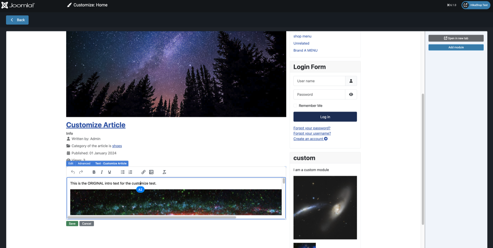
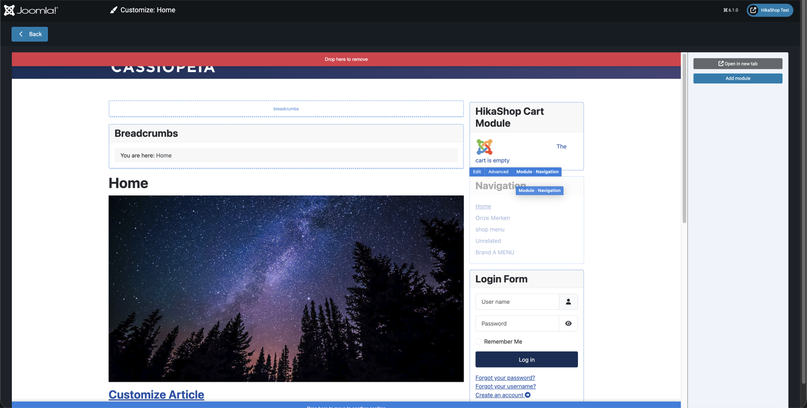
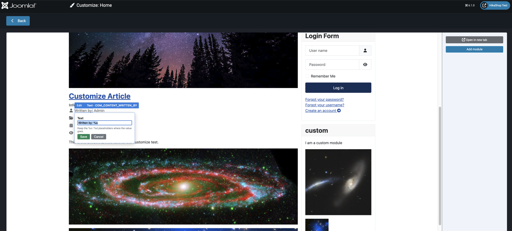

# Customize mode: demo and testing guide

> This is a demo and testing document for the `feature/customize-mode` fork. It is not part of the
> eventual joomla-cms pull request (remove `CUSTOMIZE_DEMO.md` and `docs/customize-demo/` before
> opening the PR).

Customize mode is a visual frontend editor launched per template style from **Templates: Styles**. A
**Customize** button on a site style opens an admin view that hosts a live frontend page the style is
assigned to (or the home page) in an iframe and lets you edit the page in place: article text, titles,
images and category; module settings, custom-module HTML and menu items; module placement and the
page's position layout (move, add, remove, hide, split and resize positions); any translated string;
and a layout's template override. Every edit is a normal authorised save that persists through native
Joomla mechanisms (the article model, the module table, language overrides, template overrides, and,
for layout, a per-style child template).

## Developer guides

- [CUSTOMIZE_PLUGINS.md](CUSTOMIZE_PLUGINS.md) - write a `customize`-group plugin so a component (or a
  third-party extension) makes its own front-end output editable.
- [CUSTOMIZE_TEMPLATES.md](CUSTOMIZE_TEMPLATES.md) - make a site template support layout editing
  (move / add / remove / split / resize module positions) through the core layout helper.

## Try it

This is a fork of joomla-cms (base: Joomla 6.1.0). It is a core source tree, not an installable
package, so you test it by installing Joomla from this branch.

1. Clone and check out the branch:
   ```
   git clone https://github.com/hikashop-nicolas/joomla-cms.git
   cd joomla-cms
   git checkout feature/customize-mode
   ```
2. Build the assets (the customize engine and plugins compile through the standard pipeline):
   ```
   composer install
   npm ci
   npm run update
   ```
3. Install Joomla from this source with the normal web installer (point it at an empty database). The
   `customize` plugins ship enabled on a fresh install.
4. In the administrator, go to **System -> Templates: Styles**, edit a site style (e.g. Cassiopeia -
   Default), and click **Customize** in the toolbar.

If you already have a 6.1 development checkout, you can instead merge `feature/customize-mode` into it
and re-run `npm run update`. Existing sites get the plugins enabled through the update SQL in
`administrator/components/com_admin/sql/updates`.

## The editing flow

- The host loads the menu item's live frontend page in a same-origin iframe. The right panel offers,
  for users who can manage modules, an **Add module** button.
- Hover or Tab to an editable area: it outlines and shows a small toolbar with the actions available
  for that area.
- Click **Edit** (or press Enter) to edit in place. Article and custom-module bodies open a WYSIWYG
  editor with image support; titles and translated strings edit inline; module and menu-item settings
  open a small popover.

  

- Drag a module to reorder it or move it to another position, or use Ctrl with the arrow keys; press
  Delete to remove it. Drag works for menu items in a menu module too.

  

- Edit the page's **position layout**: grab a position block by its grip to reorder it (or use its
  **Move** button to swap with another position), hide it, or **Split** it into equal columns, a ratio
  (33/67, 25/50/25, ...), stacked rows, or a 2x2 grid. Each split cell is itself a position you can
  fill, reorder, split further, or (for columns) resize by dragging the separator; **Unsplit** merges
  them back. A **Show all positions** toggle reveals every template position, even empty ones, so a
  module can be placed anywhere. Layout edits are isolated per style in a child template, so other
  styles are untouched. (Templates opt in to this; see [CUSTOMIZE_TEMPLATES.md](CUSTOMIZE_TEMPLATES.md).)

- Edit any translated string on the page (a label, a button, the "Written by" line). It saves as a
  Joomla language override that applies site-wide.

  

- Open any layout block (a view sub-layout or a module's own layout, at any nesting depth) and click
  **Edit layout** to create its template override and open Joomla's native template editor. The
  toolbar's **Parent** and **Children** controls walk the block's hierarchy, so a deeply nested layout
  is reachable without hunting for it on the page.

## What you can edit

| Plugin | What it edits | Persists as |
|---|---|---|
| content | Article text, title, image, category | Article model save |
| module | Module settings, custom-module HTML, menu-item rename/reorder/delete; the module's layout override | Module table, menu items, template override |
| position | Module placement: reorder, move position, add, remove | Module table |
| layout | Position-block layout: move, hide, add, split (columns / ratios / rows / 2x2), resize, unsplit | Per-style child template (arrangement manifest + customize.css) |
| language | Any translated string on the page | Language override |
| view | A view layout's template override, at any nesting level; parent/child block navigation | Template override |

## Permissions

Each plugin loads its editing UI only when you hold the permission needed to use it, so you never see
an affordance you cannot use (the per-action save is also checked):

- content: `core.edit` or `core.edit.own` on `com_content`
- module: the module area on `core.edit com_modules`, the menu-item area on `core.edit com_menus`
- position: `core.edit` or `core.create` on `com_modules`
- layout: `core.admin` on `com_templates` (it writes the style's child template)
- language and view (overrides): `core.admin`

## How it works

The whole system runs on one rule: in customize mode core only fires generic, mutable events and uses
the strings they return, so the `customize` plugins own all the markup, the UI and the persistence.
End to end:

1. **Launch (backend).** The **Customize** toolbar button (on a site style in Templates: Styles) opens
   the admin view `com_templates&view=customize&id=<styleId>`. It loads the engine and its API,
   registers the engine's own JS strings, and dispatches `onCustomizeAdminInit` to every `customize`
   plugin so each registers its admin JS and strings, gated on the permission it needs. The view then
   renders an iframe at a frontend page the style is assigned to (or the home page), forced to that
   style, with a signed, short-lived `customize` token appended.

2. **The frontend marks itself up.** Because the request carries a valid `customize` token,
   `CustomizeMode::isActive()` is true (the token is per-request and signed with the site secret, never
   session-sticky, so normal browsing is unaffected and anonymous visitors cannot trigger it). At each
   render point core fires a generic event and uses the returned
   string: `onCustomizeRenderView` for every rendered layout (HtmlView), `onCustomizeModule` and
   `onCustomizeEmptyPosition` for modules and empty positions (ModulesRenderer); translatable text uses
   a lighter generic collector (an event per `Text::_` call would be too costly) that the language
   plugin reads on `onAfterRender`. Each owning plugin's PHP listener injects the `data-customize-*`
   attributes, or, for the view plugin, the comment markers it later turns into blocks. A template can
   also render its editable regions through the core layout helper, which emits the contract for the
   `layout` plugin (see [CUSTOMIZE_TEMPLATES.md](CUSTOMIZE_TEMPLATES.md)). Without a valid token the
   page renders exactly as normal.

3. **The engine wires the page (backend).** The iframe is same-origin, so the admin parent reads its
   DOM directly. The engine injects the iframe stylesheet, scans for `[data-customize-type]` areas,
   draws the hover outline and floating toolbar, and wires keyboard access (a roving tabindex). It then
   emits `customize:frame-ready` so each plugin's admin JS can finish instrumenting, e.g. the view
   plugin turns its comment markers into wrapped view-blocks and reads the layout hierarchy from the DOM
   nesting.

4. **Plugins build their UI from the metadata.** Each plugin's admin JS registers its area type(s) and
   toolbar buttons, then builds the editing affordances from the `data-customize-*` metadata on the
   hovered or selected area: the article id, the module id, the layout's source file and template, a
   block's parent and children, and so on. Editing happens in place: inline WYSIWYG, popovers,
   drag-reorder, or the native template editor opened in a new tab.

5. **Saving.** A content/module/position/language/view save posts to `com_ajax` with
   `group=customize&plugin=<name>`, which dispatches `onAjax<Name>` to that plugin; template-scoped
   layout actions (move/add/remove/split/resize/unsplit a position) post to `com_templates`'
   `ajax.customize` task instead. Either way the handler verifies the CSRF token and the relevant
   permission, persists through the native Joomla mechanism (article model, module table, language
   override, template override, or the style's child-template manifest + customize.css), and returns a
   JSON result the JS uses to update the page in place or reload the iframe. If the admin session has
   expired, the save is refused and the editor is sent to the login (returning to the page afterwards).

## Known limitations

- **Same-origin by design.** If the site frontend is served from a different origin than the
  administrator (an uncommon setup), the browser blocks iframe access; customize mode detects this and
  skips instrumentation rather than failing noisily. Cross-origin support would need a postMessage
  agent in the frontend, which is out of scope.
- A layout block is made editable only when its rendered output is a safely wrappable range; a block
  whose markup cannot be wrapped safely (for example a fragment that spans sibling table rows) is
  skipped rather than risking the page layout.

## Feedback

Please open an issue on this fork with your Joomla version, PHP version, database, and steps. UI,
wording, accessibility, and edge-case reports are all welcome.
